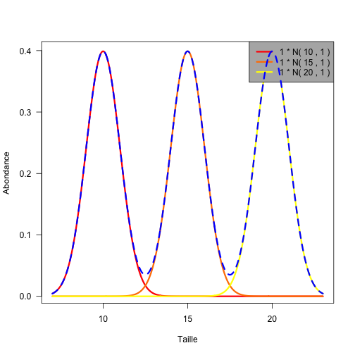
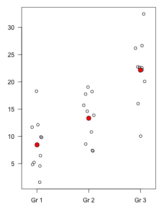
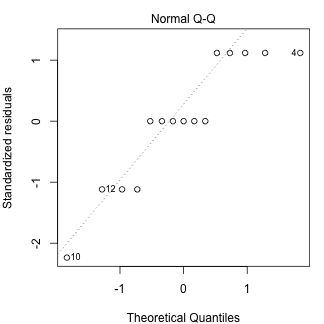
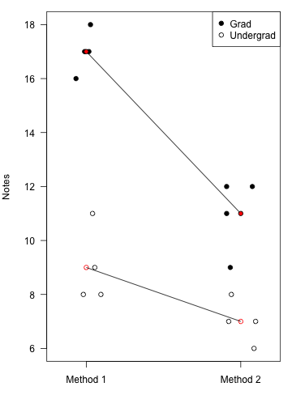

## L'ANOVA : pour quoi faire ?

<br/>

Au bout de combien de tests est-on certain de s'être trompé quelque part ?

> * Comparer la moyenne de <span style="color: #ff0000">2</span> échantillons requiert <span style="color: #ff0000">1</span> test
> * Comparer la moyenne de <span style="color: #ff0000">3</span> échantillons requiert <span style="color: #ff0000">3</span> tests
> * Comparer la moyenne de <span style="color: #ff0000">4</span> échantillons requiert <span style="color: #ff0000">6</span> tests
> * Comparer la moyenne de <span style="color: #ff0000">5</span> échantillons requiert <span style="color: #ff0000">10</span> tests
> * Comparer la moyenne de <span style="color: #ff0000">6</span> échantillons requiert <span style="color: #ff0000">15</span> tests
> * Comparer la moyenne de <span style="color: #ff0000">7</span> échantillons requiert <span style="color: #ff0000">21</span> tests

---

## L'ANOVA : pour quoi faire ?

<br/>

L'ANOVA permet de comparer la moyenne de $k$ échantillons en <span style="color: #ff0000">un seul test</span> (ou presque !).

<br/>

Pour l'ANOVA la plus simple (ANOVA 1 facteur), les hypothèses sont les suivantes :
> * $H_0$ : le facteur étudié n'a pas d'effet sur la moyenne des échantillons
> * $H_1$ : le facteur étudié a un effet sur la moyenne des échantillons

<br/>
> * $H_0$ : la moyenne de tous les échantillons est identique
> * $H_1$ : <span style="color: #ff0000">au moins</span> un échantillon a une moyenne différente des autres

---

## ANOVA et régression

Construire un <span style="color: #ff0000">modèle d'ANOVA</span> c'est exactement comme construire un modèle de régression. Il faut :
> * respecter des conditions d'application (détails plus loin)
> * disposer d'une variable expliquée quantitative (et continue)
> * disposer d'une ou plusieurs variables explicatives pouvant potentiellement influencer la variable expliquée (c'est ce qu'on cherche à déterminer)
> * avoir une idée de la façon dont les variables explicatives peuvent se combiner pour influencer la variable expliquée (effets additifs, multiplicatifs, autres ?)

<br/>
> * Une différence de taille toutefois : pour la régression, les variables explicatives sont toutes quantitatives (et continues), pour l'ANOVA, les variables explicatives sont toutes qualititives (factorielles, nominales).

--- .fill

<iframe src = './maths.jpg'></iframe>

---

## Les grands principes

Quand on souhaite comparer la moyenne de plusieurs groupes, il est important de distinguer plusieurs sources de variation : 

### La variation intra groupe

Puisque les individus d'un groupe donné subissent tous les même traitements, la variation observée ici est indépendante des facteurs étudiés et n'est donc due qu'à la variation naturelle. C'est la variation liée au hasard que les anglo-saxons nomment <span style="color: #ff0000">error variance</span>.

### La variation inter groupes

Elle représente la variation systématique due au(x) facteur(s) qui nous intéresse(nt). C'est la manifestation de l'effet qui nous intéresse : <span style="color: #ff0000">effect variance</span>.

Si l'<span style="color: #ff0000">effect variance</span> est grande devant l'<span style="color: #ff0000">error variance</span>, on aura tendance à conclure (à bon escient) que les groupes étudiés diffèrent. 

--- &twocol

## Les grands principes

Toutes choses étant égales par ailleurs, plus la variation intra groupe sera grande, moins il sera facile de distinguer les groupes

*** =left
 


*** =right

 


--- &twocol

## Les grands principes

Toutes choses étant égales par ailleurs, plus la variation inter groupes sera faible, moins il sera facile de distinguer les groupes

*** =left
 


*** =right

 


--- &twocol

## Les grands principes

Enfin, le troisième élément important est $n$, le nombre d'observations dans chaque groupe. Toutes choses étant égales par ailleurs, plus $n$ sera grand, plus nous aurons de raisons de penser qu'un niveau de différence donné entre groupes représente une différence réelle :

*** =left

 


*** =right

 


---

## Les ANOVAs que nous allons décrire :

<br/><br/>

* ANOVA un facteur, groupes indépendants
* ANOVA deux facteurs, groupes indépendants
* ANOVA un facteur, mesures répétées
* ANOVA deux facteurs, mesures mixtes
* ANOVA deux facteurs, mesures répétées

---

## Les ANOVAs que nous allons décrire :

<br/><br/>

* <span style="color: #000000">ANOVA un facteur, groupes indépendants</span>
* <span style="color: #cccccc">ANOVA deux facteurs, groupes indépendants</span>
* <span style="color: #cccccc">ANOVA un facteur, mesures répétées</span>
* <span style="color: #cccccc">ANOVA deux facteurs, mesures mixtes</span>
* <span style="color: #cccccc">ANOVA deux facteurs, mesures répétées</span>

---

## ANOVA 1 facteur, groupes indépendants

Ici, seul un unique facteur peut potentiellement influencer nos données. Si le facteur en question n'a que 2 modalités, pas la peine de s'embêter avec une ANOVA : un test de comparaison de moyennes suffit !  

Les hypothèses nulles et alternatives sont les mêmes que celles indiquées plus tôt.  

Voyons un exemple. 3 groupes de sujets passent un test de statistiques noté sur 10. Le niveau de réussite est-il variable selon les groupes ? Voici les notes :


```
  Undergrad Grad Prof
1         6    8   10
2         5    9    8
3         6    8   10
4         7    9    8
5         6    6    9
```


---

## ANOVA 1 facteur, groupes indépendants

Dans R, la façon correcte de présenter les données pour une ANOVA est la suivante :


```
   Notes    Groupe
1      6 Undergrad
2      5 Undergrad
3      6 Undergrad
4      7 Undergrad
5      6 Undergrad
6      8      Grad
7      9      Grad
8      8      Grad
9      9      Grad
10     6      Grad
11    10      Prof
12     8      Prof
13    10      Prof
14     8      Prof
15     9      Prof
```


---

## ANOVA 1 facteur, groupes indépendants

L'ANOVA est réalisée de la façon suivante :


```r
out <- aov(Notes ~ Groupe, data = notes)
summary(out)
```

```
            Df Sum Sq Mean Sq F value Pr(>F)   
Groupe       2   23.3    11.7    11.7 0.0015 **
Residuals   12   12.0     1.0                  
---
Signif. codes:  0 '***' 0.001 '**' 0.01 '*' 0.05 '.' 0.1 ' ' 1
```


<br/>

Puisque $p < \alpha$, nous concluons que le facteur testé a bien un effet sur la moyenne des groupes. Le niveau d'études a un effet sur la note obtenue au test.

---

## ANOVA 1 facteur, groupes indépendants

<br/>

Pour interpréter ce résultat, il faut revenir aux données et calculer la moyenne de chaque groupe : 

```r
tapply(notes$Notes, notes$Groupe, mean)
```

```
Undergrad      Grad      Prof 
        6         8         9 
```


---

## ANOVA 1 facteur, groupes indépendants

<br/>

À ce stade, plusieurs hypothèses sont toujours à tester :

> * tous les groupes ont des résultats significativement différents les uns des autres
> * les prof ont des résultats significativement meilleurs que les grad et undergrad, qui eux ont des résultats qui ne diffèrent pas significativement
> * les prof et grad ont des résultats significativement meilleurs que les undergrad mais les résultats des prof et grad ne diffèrent pas significativement les uns des autres
> * les prof et undergrad diffèrent significativement l'un de l'autre mais aucun des 2 groupes ne diffère des grad.
> * aucun groupe ne diffère significativement des autres groupes

---

## ANOVA 1 facteur, groupes indépendants

Pour trancher, nous avons donc besoin d'un test de comparaisons multiples. Dans le cas d'une ANOVA 1 facteur avec des groupes indépendants, et à supposer que les conditions d'applications de l'ANOVA étaient bien réunies, le test de Student est une solution adaptée, à condition de tenir compte de l'augmentation de l'erreur de type I : 


```r
pairwise.t.test(notes$Notes, notes$Groupe)
```

```

	Pairwise comparisons using t tests with pooled SD 

data:  notes$Notes and notes$Groupe 

     Undergrad Grad  
Grad 0.0164    -     
Prof 0.0014    0.1398

P value adjustment method: holm 
```


---

## ANOVA 1 facteur, groupes indépendants

### Conditions d'application

> * Globalement, il y a toujours 3 conditions d'application à vérifier :
    * Indépendance des échantillons
    * Normalité de la distribution des données de chaque groupe
    * Homogénéité des variances entre les groupes
> * Dans la pratique, la condition d'indépendance est très importante et le choix d'un modèle d'ANOVA approprié est crucial. Ici, chaque sujet/individu ne peut appartenir/contribuer qu'à un seul groupe. Si un sujet fournit plusieurs scores, c'est l'ANOVA sur mesures répétées qu'il convient d'utiliser.
> * Les tests de normalité sont très peu puissants quand $n$ est faible.
> * Les tests d'homoscédasticité aussi !

--- &twocol

## ANOVA 1 facteur, groupes indépendants

### Conditions d'application

Dans la pratique, la normalité des données et l'homogénéité des variances est vérifiée grâce aux <span style="color: #ff0000">résidus</span> de l'ANOVA. Les conditions d'application ne peuvent donc être vérifiées qu'après l'analyse.

*** =left


```r
plot(out, which = 2)
```

 


*** =right

```r
plot(out, which = 1)
```

 


---

## ANOVA 1 facteur, groupes indépendants

### Conditions d'application

Ici, les résidus semblent homogènes, mais ils ne suivent pas la loi normale :


```r
shapiro.test(out$residuals)
```

```

	Shapiro-Wilk normality test

data:  out$residuals
W = 0.8618, p-value = 0.02565
```


Il faudrait donc :
> * soit transformer les données
> * soit faire un équivalent non paramétrique de l'ANOVA
> * soit passer outre en consdérant que l'ANOVA est assez robuste : les résultats restent valides même si ces 2 conditions d'application sont <span style="color: #ff0000">un peu violées mais pas en même temps</span> !

---

## ANOVA 1 facteur, groupes indépendants

### Conditions d'application

Puisque les résidus ne suivent pas la loi normale, il semble plus raisonnable d'utiliser le test de Wilcoxon en guise de test de comparaisons multiples :


```r
pairwise.wilcox.test(notes$Notes, notes$Groupe)
```

```

	Pairwise comparisons using Wilcoxon rank sum test 

data:  notes$Notes and notes$Groupe 

     Undergrad Grad 
Grad 0.079     -    
Prof 0.032     0.273

P value adjustment method: holm 
```


---

## Les ANOVAs que nous allons décrire :

<br/><br/>

* <span style="color: #cccccc">ANOVA un facteur, groupes indépendants</span>
* <span style="color: #000000">ANOVA deux facteurs, groupes indépendants</span>
* <span style="color: #cccccc">ANOVA un facteur, mesures répétées</span>
* <span style="color: #cccccc">ANOVA deux facteurs, mesures mixtes</span>
* <span style="color: #cccccc">ANOVA deux facteurs, mesures répétées</span>

---

## ANOVA 2 facteurs, groupes indépendants

Ici, deux facteurs peuvent potentiellement influencer la variable expliquée. Sachant que chaque facteur peut avoir deux modalités ou plus, le nombre de cas à examiner peut rapidement augmenter.  

Puisque les groupes sont ici indépendants, chaque sujet/individu ne fournit qu'<span style="color: #ff0000">un seul score</span>.  

Voici un exemple de design expérimental pour 2 facteurs et 2 modalités par facteur :

<!-- html table generated in R 3.0.2 by xtable 1.7-1 package -->
<!-- Wed Apr 16 15:37:59 2014 -->
<TABLE border=1>
<TR> <TH>  </TH> <TH> Teach.meth.1 </TH> <TH> Teach.meth.2 </TH>  </TR>
  <TR> <TD align="right"> Undergrad </TD> <TD align="right"> 8.00 </TD> <TD align="right"> 6.00 </TD> </TR>
  <TR> <TD align="right">   </TD> <TD align="right"> 11.00 </TD> <TD align="right"> 7.00 </TD> </TR>
  <TR> <TD align="right">    </TD> <TD align="right"> 8.00 </TD> <TD align="right"> 8.00 </TD> </TR>
  <TR> <TD align="right">     </TD> <TD align="right"> 9.00 </TD> <TD align="right"> 7.00 </TD> </TR>
  <TR> <TD align="right"> Grad </TD> <TD align="right"> 16.00 </TD> <TD align="right"> 12.00 </TD> </TR>
  <TR> <TD align="right">      </TD> <TD align="right"> 18.00 </TD> <TD align="right"> 11.00 </TD> </TR>
  <TR> <TD align="right">       </TD> <TD align="right"> 17.00 </TD> <TD align="right"> 12.00 </TD> </TR>
  <TR> <TD align="right">        </TD> <TD align="right"> 17.00 </TD> <TD align="right"> 9.00 </TD> </TR>
   </TABLE>


---

## ANOVA 2 facteurs, groupes indépendants

Comme précédemment, la façon correcte de présenter ces données dans R est la suivante :


```
   Notes Teaching  Students
1      8 Method.1 Undergrad
2     11 Method.1 Undergrad
3      8 Method.1 Undergrad
4      9 Method.1 Undergrad
5     16 Method.1      Grad
6     18 Method.1      Grad
7     17 Method.1      Grad
8     17 Method.1      Grad
9      6 Method.2 Undergrad
10     7 Method.2 Undergrad
11     8 Method.2 Undergrad
12     7 Method.2 Undergrad
13    12 Method.2      Grad
14    11 Method.2      Grad
15    12 Method.2      Grad
16     9 Method.2      Grad
```


---

## ANOVA 2 facteurs, groupes indépendants

Ici, nous allons tenter de déterminer si (i) la note moyenne obtenue diffère selon le niveau d'études, (ii) la note moyenne obtenue diffère selon la méthode d'enseignement et (iii) les 2 méthodes ont la même efficacité pour enseigner aux étudiants des 2 niveaux.  

Il y aura donc 3 groupes d'hypothèses qui seront testées simultanément : 
> * $H_0$ : le niveau d'étude n'influence pas la moyenne obtenue
> * $H_1$ : le niveau d'étude influence la moyenne obtenue

<br/>
> * $H_0$ : la méthode d'enseignement n'influence pas la moyenne obtenue
> * $H_1$ : la méthode d'enseignement influence la moyenne obtenue

<br/>
> * $H_0$ : la méthode d'enseignement influence de la même façon les 2 groupes d'étudiants
> * $H_1$ : la méthode d'enseignement influence de façon différente les 2 groupes d'étudiants

---

## ANOVA 2 facteurs, groupes indépendants


```r
out <- aov(Notes ~ Students * Teaching, data = dat)
summary(out)
```

```
                  Df Sum Sq Mean Sq F value  Pr(>F)    
Students           1    144   144.0     108 2.4e-07 ***
Teaching           1     64    64.0      48 1.6e-05 ***
Students:Teaching  1     16    16.0      12  0.0047 ** 
Residuals         12     16     1.3                    
---
Signif. codes:  0 '***' 0.001 '**' 0.01 '*' 0.05 '.' 0.1 ' ' 1
```


Les 3 hypothèses nulles sont donc rejetées. L'interprétation est aisée puisque chaque facteur n'a que 2 modalités. S'ils en avaient plus, il faudrait recourrir aux tests de comparaisons multiples.

---

## ANOVA 2 facteurs, groupes indépendants

### Comparaisons multiples


```r
TukeyHSD(out,"Students")
```

```
  Tukey multiple comparisons of means
    95% family-wise confidence level

Fit: aov(formula = Notes ~ Students * Teaching, data = dat)

$Students
               diff    lwr    upr p adj
Undergrad-Grad   -6 -7.258 -4.742     0
```


---

## ANOVA 2 facteurs, groupes indépendants

### Comparaisons multiples


```r
TukeyHSD(out,"Teaching")
```

```
  Tukey multiple comparisons of means
    95% family-wise confidence level

Fit: aov(formula = Notes ~ Students * Teaching, data = dat)

$Teaching
                  diff    lwr    upr p adj
Method.2-Method.1   -4 -5.258 -2.742     0
```


---

## ANOVA 2 facteurs, groupes indépendants

### Comparaisons multiples


```r
TukeyHSD(out,"Students:Teaching")
```

```
  Tukey multiple comparisons of means
    95% family-wise confidence level

Fit: aov(formula = Notes ~ Students * Teaching, data = dat)

$`Students:Teaching`
                                      diff      lwr     upr  p adj
Undergrad:Method.1-Grad:Method.1        -8 -10.4241 -5.5759 0.0000
Grad:Method.2-Grad:Method.1             -6  -8.4241 -3.5759 0.0000
Undergrad:Method.2-Grad:Method.1       -10 -12.4241 -7.5759 0.0000
Grad:Method.2-Undergrad:Method.1         2  -0.4241  4.4241 0.1200
Undergrad:Method.2-Undergrad:Method.1   -2  -4.4241  0.4241 0.1200
Undergrad:Method.2-Grad:Method.2        -4  -6.4241 -1.5759 0.0018
```


--- &vcenter

## ANOVA 2 facteurs, groupes indépendants

### Visualiser les effets et les interactions

 


--- &twocol

## ANOVA 2 facteurs, groupes indépendants

### Vérification des conditions d'application

Évidemment, tout ceci suppose que les conditions d'applications soient vérifiées :

*** =left


```r
plot(out, which = 2)
```

 


*** =right

```r
plot(out, which = 1)
```

 


---

## ANOVA 2 facteurs, groupes indépendants

### Vérification des conditions d'application

Les résidus semblent homogènes et ils sont distribués normalement :


```r
shapiro.test(out$residuals)
```

```

	Shapiro-Wilk normality test

data:  out$residuals
W = 0.932, p-value = 0.2619
```


C'est donc tout bon !

---

## Les ANOVAs que nous allons décrire :

<br/><br/>

* <span style="color: #cccccc">ANOVA un facteur, groupes indépendants</span>
* <span style="color: #cccccc">ANOVA deux facteurs, groupes indépendants</span>
* <span style="color: #000000">ANOVA un facteur, mesures répétées</span>
* <span style="color: #cccccc">ANOVA deux facteurs, mesures mixtes</span>
* <span style="color: #cccccc">ANOVA deux facteurs, mesures répétées</span>

---

## ANOVA 1 facteur, mesures répétées

Ici, chaque sujet fournit <span style="color: #ff0000">plusieurs scores : un pour chaque modalité</span> du facteur étudié.  

Exemple : 4 individus subissent un test par semaine pendant 3 semaines.

<!-- html table generated in R 3.0.2 by xtable 1.7-1 package -->
<!-- Wed Apr 16 15:38:00 2014 -->
<TABLE border=1>
<TR> <TH>  </TH> <TH> Week.1 </TH> <TH> Week.2 </TH> <TH> Week.3 </TH>  </TR>
  <TR> <TD align="right"> subject.1 </TD> <TD align="right"> 2.00 </TD> <TD align="right"> 5.00 </TD> <TD align="right"> 8.00 </TD> </TR>
  <TR> <TD align="right"> subject.2 </TD> <TD align="right"> 4.00 </TD> <TD align="right"> 4.00 </TD> <TD align="right"> 9.00 </TD> </TR>
  <TR> <TD align="right"> subject.3 </TD> <TD align="right"> 5.00 </TD> <TD align="right"> 8.00 </TD> <TD align="right"> 10.00 </TD> </TR>
  <TR> <TD align="right"> subject.4 </TD> <TD align="right"> 5.00 </TD> <TD align="right"> 7.00 </TD> <TD align="right"> 9.00 </TD> </TR>
   </TABLE>


</br>
En fait, on peut considérer qu'il s'agit d'une ANOVA 2 facteurs avec un facteur fixe (Semaine) et un facteur aléatoire (Sujet). Dans la pratique, seul le facteur Semaine nous intéresse. C'est un facteur fixe car si nous devions refaire la même expérience, les mêmes dates pourraient être choisies.

---

## ANOVA 1 facteur, mesures répétées

La présentation correcte des données dans R est la suivante :


```
   Notes Week Subject
1      2    1       1
2      4    1       2
3      5    1       3
4      5    1       4
5      5    2       1
6      4    2       2
7      8    2       3
8      7    2       4
9      8    3       1
10     9    3       2
11    10    3       3
12     9    3       4
```


---

## ANOVA 1 facteur, mesures répétées

Ici, les hypothèses nulles et alternatives sont les suivantes :

* $H_0$ : Les notes ne varient pas avec le temps ; $H_1$ : Les notes varient avec le temps


```r
out <- aov(Notes ~ Week + Error(Subject), data = dat)
summary(out)
```

```

Error: Subject
          Df Sum Sq Mean Sq F value Pr(>F)
Residuals  3   13.3    4.44               

Error: Within
          Df Sum Sq Mean Sq F value Pr(>F)    
Week       2   50.7   25.33    32.6  6e-04 ***
Residuals  6    4.7    0.78                   
---
Signif. codes:  0 '***' 0.001 '**' 0.01 '*' 0.05 '.' 0.1 ' ' 1
```


---

## ANOVA 1 facteur, mesures répétées

Il est possible de calculer "à la main" la valeur de probabilité associée à une valeur de $F$ et des degrés de liberté donnés.


```
          Df Sum Sq Mean Sq F value Pr(>F)    
Week       2   50.7   25.33    32.6  6e-04 ***
Residuals  6    4.7    0.78                   
---
Signif. codes:  0 '***' 0.001 '**' 0.01 '*' 0.05 '.' 0.1 ' ' 1
```

```r
1 - pf(32.6, 2, 6)
```

```
[1] 0.0005984
```


Ça sera utile pour calculer une $p-$value corrigée si l'une des conditions d'application n'est pas vérifiée.  

---

## ANOVA 1 facteur, mesures répétées

</br>
Car tous les modèles d'ANOVA avec mesures répétées possèdent une condition d'application supplémentaire : <span style="color: #ff0000">la sphéricité</span> (sphéritude ?) qui peut être testée avec le <span style="color: #ff0000">test de Mauchly</span> (mais souvent problématique selon la taille d'échantillon). 
  

Si les données ne sont pas sphériques, l'erreur de type I peut fortement augmenter. On peut alors :

> * transformer les données
> * corriger les p-values obtenues grâce au calcul d'$\varepsilon$
> * passer par la procédure de MANOVA (ANOVA multivariée)
> * aller boire un coup

---

## ANOVA 1 facteur, mesures répétées

Puisque le test de Mauchly est <span style="color: #ff0000">très critiqué</span>, la méthode du calcul d'$\varepsilon$ est généralement utilisée.  

$\varepsilon$ mesure la sphéricité et varie entre 1 (données sphériques, tout va bien) et $\frac{1}{k-1}$ avec $k$ égal au nombre de mesures répétées (ici, $k=3$).  

$\varepsilon$ permet alors de corriger la $p-$value de l'ANOVA. Pour cela, on multiplie simplement les degrés de liberté par $\frac{1}{k-1}$. La $p-$value devient donc :


```r
1 - pf(32.6, 2 * 0.5, 6 * 0.5)
```

```
[1] 0.01066
```


au lieu de 


```
[1] 0.0005984
```


---

## ANOVA 1 facteur, mesures répétées

<br/>

Pour interpréter ce résultat, il faut revenir aux données et calculer la moyenne de chaque groupe : 

```r
tapply(dat$Notes, dat$Week, mean)
```

```
1 2 3 
4 6 9 
```


---

## ANOVA 1 facteur, mesures répétées

<br/>

À ce stade, plusieurs hypothèses sont toujours à tester :

* tous les groupes ont des résultats significativement différents les uns des autres
* les prof ont des résultats significativement meilleurs que les grad et undergrad, qui eux ont des résultats qui ne diffèrent pas significativement
* les prof et grad ont des résultats significativement meilleurs que les undergrad mais les résultats des prof et grad ne diffèrent pas significativement les uns des autres
* les prof et undergrad diffèrent significativement l'un de l'autre mais aucun des 2 groupes ne diffère des grad.
* aucun groupe ne diffère significativement des autres groupes

---

## ANOVA 1 facteur, mesures répétées

Pour trancher, nous avons donc besoin d'un test de comparaisons multiples. Dans le cas d'une ANOVA 1 facteur avec des mesures répétées, et à supposer que les conditions d'applications de l'ANOVA étaient bien réunies, le <span style="color: #ff0000">test de Student sur données appariées</span> est une solution adaptée, à condition de tenir compte de l'augmentation de l'erreur de type I : 


```r
pairwise.t.test(dat$Notes, dat$Week, paired = TRUE)
```

```

	Pairwise comparisons using paired t tests 

data:  dat$Notes and dat$Week 

  1      2     
2 0.0663 -     
3 0.0035 0.0480

P value adjustment method: holm 
```


---

## ANOVA 1 facteur, mesures répétées

### La puissance de l'ANOVA

Le choix d'un design expérimental a des conséquences sur le type d'analyse statistique qu'il sera possible de réaliser. Or toutes les analyses n'ont pas la même puissance.

Le modèle d'ANOVA un facteur sur mesures répétées est <span style="color: #ff0000">plus puissant</span> que le modèle un facteur groupes indépendants. 

Exemple :

<!-- html table generated in R 3.0.2 by xtable 1.7-1 package -->
<!-- Wed Apr 16 15:38:00 2014 -->
<TABLE border=1>
<TR> <TH> 1 </TH> <TH> 2 </TH> <TH> 3 </TH>  </TR>
  <TR> <TD align="right"> 11.00 </TD> <TD align="right"> 12.00 </TD> <TD align="right"> 13.00 </TD> </TR>
  <TR> <TD align="right"> 8.00 </TD> <TD align="right"> 10.00 </TD> <TD align="right"> 12.00 </TD> </TR>
  <TR> <TD align="right"> 5.00 </TD> <TD align="right"> 8.00 </TD> <TD align="right"> 11.00 </TD> </TR>
  <TR> <TD align="right"> 4.00 </TD> <TD align="right"> 6.00 </TD> <TD align="right"> 8.00 </TD> </TR>
   </TABLE>


---

## ANOVA 1 facteur, mesures répétées

### La puissance de l'ANOVA


```r
summary(aov(Notes ~ Week + Error(Subject), data = dat)$Within)
```

```
          Df Sum Sq Mean Sq F value Pr(>F)   
Week       2     32   16.00      24 0.0014 **
Residuals  6      4    0.67                  
---
Signif. codes:  0 '***' 0.001 '**' 0.01 '*' 0.05 '.' 0.1 ' ' 1
```


```r
summary(aov(Notes ~ Week, data = dat))
```

```
            Df Sum Sq Mean Sq F value Pr(>F)
Week         2     32   16.00    2.25   0.16
Residuals    9     64    7.11               
```


---

## Les ANOVAs que nous allons décrire :

<br/><br/>

* <span style="color: #cccccc">ANOVA un facteur, groupes indépendants</span>
* <span style="color: #cccccc">ANOVA deux facteurs, groupes indépendants</span>
* <span style="color: #cccccc">ANOVA un facteur, mesures répétées</span>
* <span style="color: #000000">ANOVA deux facteurs, mesures mixtes</span>
* <span style="color: #cccccc">ANOVA deux facteurs, mesures répétées</span>

---

## ANOVA 2 facteurs, mesures mixtes

Ici, les individus sont répartis en plusieurs groupes selon un facteur et chaque individu fournit nevaleur pour chaque modalité du second facteur.

Exemple : test de l'effet d'une drogue X au cours du temps sur les capacités cognitives. Comparaison d'un groupe traité avec un groupe témoin.

<!-- html table generated in R 3.0.2 by xtable 1.7-1 package -->
<!-- Wed Apr 16 15:38:00 2014 -->
<TABLE border=1>
<TR> <TH>  </TH> <TH> T10 </TH> <TH> T20 </TH> <TH> T30 </TH>  </TR>
  <TR> <TD align="right"> Drug.Subject1 </TD> <TD align="right"> 28.00 </TD> <TD align="right"> 25.00 </TD> <TD align="right"> 34.00 </TD> </TR>
  <TR> <TD align="right"> Drug.Subject2 </TD> <TD align="right"> 23.00 </TD> <TD align="right"> 30.00 </TD> <TD align="right"> 32.00 </TD> </TR>
  <TR> <TD align="right"> Drug.Subject3 </TD> <TD align="right"> 25.00 </TD> <TD align="right"> 30.00 </TD> <TD align="right"> 35.00 </TD> </TR>
  <TR> <TD align="right"> Drug.Subject4 </TD> <TD align="right"> 24.00 </TD> <TD align="right"> 35.00 </TD> <TD align="right"> 39.00 </TD> </TR>
  <TR> <TD align="right"> Placebo.Subject5 </TD> <TD align="right"> 28.00 </TD> <TD align="right"> 22.00 </TD> <TD align="right"> 24.00 </TD> </TR>
  <TR> <TD align="right"> Placebo.Subject6 </TD> <TD align="right"> 24.00 </TD> <TD align="right"> 23.00 </TD> <TD align="right"> 22.00 </TD> </TR>
  <TR> <TD align="right"> Placebo.Subject7 </TD> <TD align="right"> 23.00 </TD> <TD align="right"> 26.00 </TD> <TD align="right"> 21.00 </TD> </TR>
  <TR> <TD align="right"> Placebo.Subject8 </TD> <TD align="right"> 21.00 </TD> <TD align="right"> 21.00 </TD> <TD align="right"> 21.00 </TD> </TR>
   </TABLE>


---

## ANOVA 2 facteurs, mesures mixtes

Comme pour l'ANOVA 2 facteurs sur groupes indépendants, il y a 3 couples d'hypothèses :

> * $H_0$ : la drogue X n'a pas d'effet sur les capacités cognitives
> * $H_1$ : la drogue X a un effet sur les capacités cognitives

</br>
> * $H_0$ : les capacités cognitives sont constantes au cours du temps
> * $H_1$ : les capacités cognitives sont variables au cours du temps

</br>
> * $H_0$ : les capacités cognitives évoluent de la même façon au cours du temps avec et sans drogue X
> * $H_1$ : les capacités cognitives évoluent différemment au cours du temps avec et sans drogue X

--- &twocol

## ANOVA 2 facteurs, mesures mixtes

Mise en forme pour travailler dans R :

*** =left


```
   Reaction Time    Drug   Subject
1        28  T10       X Subject.1
2        23  T10       X Subject.2
3        25  T10       X Subject.3
4        24  T10       X Subject.4
5        28  T10 Placebo Subject.5
6        24  T10 Placebo Subject.6
7        23  T10 Placebo Subject.7
8        21  T10 Placebo Subject.8
9        25  T20       X Subject.1
10       30  T20       X Subject.2
11       30  T20       X Subject.3
12       35  T20       X Subject.4
```


*** =right


```
   Reaction Time    Drug   Subject
13       22  T20 Placebo Subject.5
14       23  T20 Placebo Subject.6
15       26  T20 Placebo Subject.7
16       21  T20 Placebo Subject.8
17       34  T30       X Subject.1
18       32  T30       X Subject.2
19       35  T30       X Subject.3
20       39  T30       X Subject.4
21       24  T30 Placebo Subject.5
22       22  T30 Placebo Subject.6
23       21  T30 Placebo Subject.7
24       21  T30 Placebo Subject.8
```


---

## ANOVA 2 facteurs, mesures mixtes


```r
out <- aov(Reaction ~ Time * Drug + Error(Subject), data = dat)
summary(out)
```

```

Error: Subject
          Df Sum Sq Mean Sq F value Pr(>F)   
Drug       1  294.0   294.0    33.1 0.0012 **
Residuals  6   53.3     8.9                  
---
Signif. codes:  0 '***' 0.001 '**' 0.01 '*' 0.05 '.' 0.1 ' ' 1

Error: Within
          Df Sum Sq Mean Sq F value Pr(>F)   
Time       2   64.0    32.0    4.65 0.0321 * 
Time:Drug  2  144.0    72.0   10.45 0.0024 **
Residuals 12   82.7     6.9                  
---
Signif. codes:  0 '***' 0.001 '**' 0.01 '*' 0.05 '.' 0.1 ' ' 1
```


---

## ANOVA 2 facteurs, mesures mixtes

Ici, on rejette $H_0$ systématiquement. Toutefois, si l'on ajuste le calcul des $p-$ value pour tenir compte de la (non) sphéricité pour le facteur répété, les conclusions changent :


```
          Df Sum Sq Mean Sq F value Pr(>F)   
Time       2   64.0    32.0    4.65 0.0321 * 
Time:Drug  2  144.0    72.0   10.45 0.0024 **
Residuals 12   82.7     6.9                  
---
Signif. codes:  0 '***' 0.001 '**' 0.01 '*' 0.05 '.' 0.1 ' ' 1
```

```r
1 - pf(4.645, 1, 6)
```

```
[1] 0.07457
```

```r
1 - pf(10.452, 1, 6)
```

```
[1] 0.01784
```


---

## ANOVA 2 facteurs, mesures mixtes

### Interprétation des résultats

Pour interpréter ces résultats, on peut calculer les moyennes par catégorie


```r
tapply(dat$Reaction, list(dat$Drug, dat$Time), mean)
```

```
        T10 T20 T30
Placebo  24  23  22
X        25  30  35
```


---

## ANOVA 2 facteurs, mesures mixtes

### Interprétation des résultats

On peut aussi faire le graphique des interactions


```r
with(dat, interaction.plot(Time, Drug, Reaction, type = "b", pch = c(1, 19)))
```

 


---

## ANOVA 2 facteurs, mesures mixtes

### Interprétation des résultats

Nous pouvons donc conclure que le temps nécessaire à la réalisation du test cognitif prend en moyenne 30 secondes pour les sujets ayant reçu la drogue X, contre 23 secondes pour les sujets sous placébo, ce qui est significatif au seuil $\alpha =$ 0.01 ($p=$ 0.0012).

</br>
Le temps de réaction augmente (les performances se dégradent) avec le temps puisque les temps de réaction moyens sont les suivants :

```
 T10  T20  T30 
24.5 26.5 28.5 
```

Cette dégradation des performances n'est pas significative au seuil $\alpha =$ 0.05 ($p=$ 0.0746) 

</br>
Les performances des sujets sous placébo s'améliorent faiblement avec le temps alors qu'elle diminuent fortement chez les patients traités avec la drogue X. Cet effet est significatif au seuil $\alpha =$ 0.05 ($p=$ 0.0178)

---

## Les ANOVAs que nous allons décrire :

<br/><br/>

* <span style="color: #cccccc">ANOVA un facteur, groupes indépendants</span>
* <span style="color: #cccccc">ANOVA deux facteurs, groupes indépendants</span>
* <span style="color: #cccccc">ANOVA un facteur, mesures répétées</span>
* <span style="color: #cccccc">ANOVA deux facteurs, mesures mixtes</span>
* <span style="color: #000000">ANOVA deux facteurs, mesures répétées</span>

---

## ANOVA 2 facteurs, mesures répétées

</br>
Ici, chaque individu fournit un score pour chaque combinaison de modalité des 2 facteurs étudiés. Comme pour l'ANOVA 1 facteur, ce design est beaucoup plus puissant que l'ANOVA 2 facteurs sur groupes indépendants.

Exemple : capacité de détecter certains sons (haute ou basse fréquence) en fonction de la présence d'un bruit de fond à haute ou basse fréquence. Chaque sujet fait 2 seesions d'écoute, une dans chaque condition de bruit de fond. Pour chaque session, les sujets sont soumis à 30 stimuli haute fréquence et 30 stimuli basse fréquence. Le score correspond au nombre de stimuli détecté dans chaque condition.

</br>
Le questionnement scientifique est le suivant : est-ce que le bruit de fond affecte la capacité des sujets à détecter différents stimuli ?

---

## ANOVA 2 facteurs, mesures répétées

### Les données

<!-- html table generated in R 3.0.2 by xtable 1.7-1 package -->
<!-- Wed Apr 16 15:38:01 2014 -->
<TABLE border=1>
<TR> <TH>  </TH> <TH> Bg.low </TH> <TH> Bg.Low </TH> <TH> Bg.High </TH> <TH> Bg.High </TH>  </TR>
  <TR> <TD align="right">  </TD> <TD> Stim.Low </TD> <TD> Stim.High </TD> <TD> Stim.Low </TD> <TD> Stim.High </TD> </TR>
  <TR> <TD align="right"> S1 </TD> <TD> 12 </TD> <TD> 18 </TD> <TD> 20 </TD> <TD> 8 </TD> </TR>
  <TR> <TD align="right"> S2 </TD> <TD> 9 </TD> <TD> 20 </TD> <TD> 24 </TD> <TD> 10 </TD> </TR>
  <TR> <TD align="right"> S3 </TD> <TD> 9 </TD> <TD> 22 </TD> <TD> 16 </TD> <TD> 9 </TD> </TR>
  <TR> <TD align="right"> S4 </TD> <TD> 10 </TD> <TD> 22 </TD> <TD> 18 </TD> <TD> 11 </TD> </TR>
  <TR> <TD align="right"> S5 </TD> <TD> 9 </TD> <TD> 17 </TD> <TD> 18 </TD> <TD> 10 </TD> </TR>
  <TR> <TD align="right"> S6 </TD> <TD> 11 </TD> <TD> 23 </TD> <TD> 22 </TD> <TD> 12 </TD> </TR>
   </TABLE>


---

## ANOVA 2 facteurs, mesures répétées

### Hypothèses

> * $H_0$ : le bruit de fond n'a pas d'effet sur les capacités de détection
> * $H_1$ : le bruit de fond affecte les capacités de détection

</br>
> * $H_0$ : la fréquence du stimulus n'affecte pas la capacité de détection
> * $H_1$ : la fréquence du stimulus affecte la capacité de détection

</br>
> * $H_0$ : la qualité du bruit de fond affecte de la même façon la capacité de détection de stimuli à différentes fréquences
> * $H_1$ : la qualité du bruit de fond affecte de façon différente la capacité de détection de stimuli à différentes fréquences

--- &twocol

## ANOVA 2 facteurs, mesures répétées

### Mise en forme des données pour R :

*** =left


```
   Score Noise Stimulus   Subject
1     12   Low      Low Subject.1
2      9   Low      Low Subject.2
3      9   Low      Low Subject.3
4     10   Low      Low Subject.4
5      9   Low      Low Subject.5
6     11   Low      Low Subject.6
7     18   Low     High Subject.1
8     20   Low     High Subject.2
9     22   Low     High Subject.3
10    22   Low     High Subject.4
11    17   Low     High Subject.5
12    23   Low     High Subject.6
```


*** =right


```
   Score Noise Stimulus   Subject
13    20  High      Low Subject.1
14    24  High      Low Subject.2
15    16  High      Low Subject.3
16    18  High      Low Subject.4
17    18  High      Low Subject.5
18    22  High      Low Subject.6
19     8  High     High Subject.1
20    10  High     High Subject.2
21     9  High     High Subject.3
22    11  High     High Subject.4
23    10  High     High Subject.5
24    12  High     High Subject.6
```


---

## ANOVA 2 facteurs, mesures répétées

### Réalisation de l'ANOVA :


```r
out <- aov(Score ~ Noise * Stimulus + Error(Subject/(Noise * Stimulus)), data = dat)
summary(out)
```


---

## ANOVA 2 facteurs, mesures répétées


```

Error: Subject
          Df Sum Sq Mean Sq F value Pr(>F)
Residuals  5   32.5     6.5               

Error: Subject:Noise
          Df Sum Sq Mean Sq F value Pr(>F)
Noise      1   0.67    0.67    0.18   0.69
Residuals  5  18.83    3.77               

Error: Subject:Stimulus
          Df Sum Sq Mean Sq F value Pr(>F)
Stimulus   1   0.67    0.67    0.12   0.74
Residuals  5  26.83    5.37               

Error: Subject:Noise:Stimulus
               Df Sum Sq Mean Sq F value Pr(>F)    
Noise:Stimulus  1    600     600     240  2e-05 ***
Residuals       5     12       2                   
---
Signif. codes:  0 '***' 0.001 '**' 0.01 '*' 0.05 '.' 0.1 ' ' 1
```


---

## ANOVA 2 facteurs, mesures répétées

### Interprétation

</br>
Ici, chaque facteur n'a que 2 modalités : pas de problème de sphéricité.  

</br>
> 1. Bruit de fond : nous n'avons aucune preuve que la qualité du bruit de fond affecte la capacité de détection des stimuli
> 2. Stimulus : nous n'avons aucune preuve que la capacité de détection d'un stimulus soit liée à la fréquence du stimulus
> 3. Interaction : nous avons la preuve ($p <<$ 0.001) que la capacité de détecter un stimulus de haute ou basse fréquence dépend de la qualité du bruit de fond.

--- &vcenter

## ANOVA 2 facteurs, mesures répétées


```r
with(dat, interaction.plot(Noise, Stimulus, Score, type = "b", pch = c(1, 19)))
```

 


---

## Les ANOVAs que nous ~~allons décrire~~ avons décrites :

<br/><br/>

* ANOVA un facteur, groupes indépendants
* ANOVA deux facteurs, groupes indépendants
* ANOVA un facteur, mesures répétées
* ANOVA deux facteurs, mesures mixtes
* ANOVA deux facteurs, mesures répétées

---

## Les ANOVAs ou méthodes proches que pourrions décrire :

<br/><br/>

> * ANOVA hiérarchiques
> * ANOVA k facteurs : bon courage pour l'interprétation
> * ANOVA "unbalanced"
> * MANOVA (Anova multivariées)
> * ANCOVA (Analyse de covariance)
> * AMOVA (Analyse de variance moléculaire)

